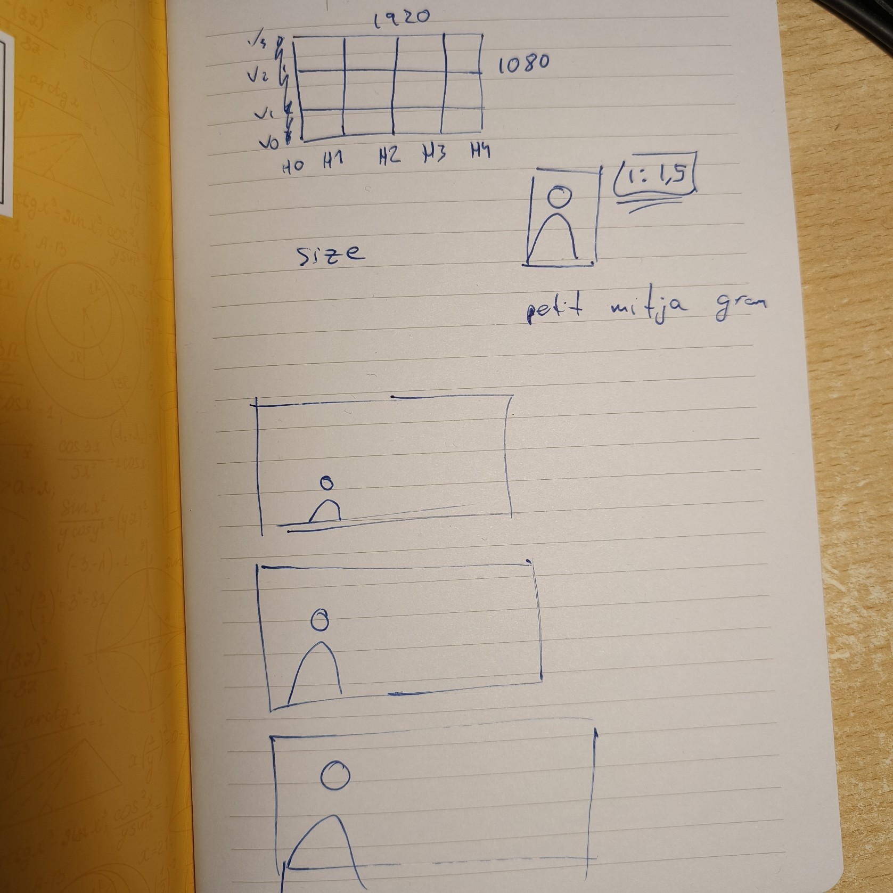

# SparkSeed project

## What is this?
First alpha version of the SparkEngine is SparkSeed, here I will be learning how to use the libraries, and dealing whith all the problems of creating a game engine on my own, I hope in order to have it easier in the SparkEngine creation process whenever I finish this one!

## Needed libraries:
- SDL2 (install libsdl2-dev)
- SDL2_image library (install libsdl-image1.2-dev)

## Compile:
``gcc -o main SparkSeed.c -lSDL2 -lSDL2_image``

## Simple arrow move:
```c
while (SDL_PollEvent(&e) != 0) {
    if (e.type == SDL_QUIT) {
        running = 0;
    } else if (e.type == SDL_KEYDOWN) {
        switch (e.key.keysym.sym) {
            case SDLK_UP:
                y = (y > 0) ? y - 1 : y;
                break;
            case SDLK_DOWN:
                y = (y < SCREEN_HEIGHT - 1) ? y + 1 : y;
                break;
            case SDLK_LEFT:
                x = (x > 0) ? x - 1 : x;
                break;
            case SDLK_RIGHT:
                x = (x < SCREEN_WIDTH - 1) ? x + 1 : x;
                break;
            case SDLK_SPACE:
                color = (color < 7) ? color + 1 : 0;
                break;
        }
    }
}

```

## Engine ideas:
